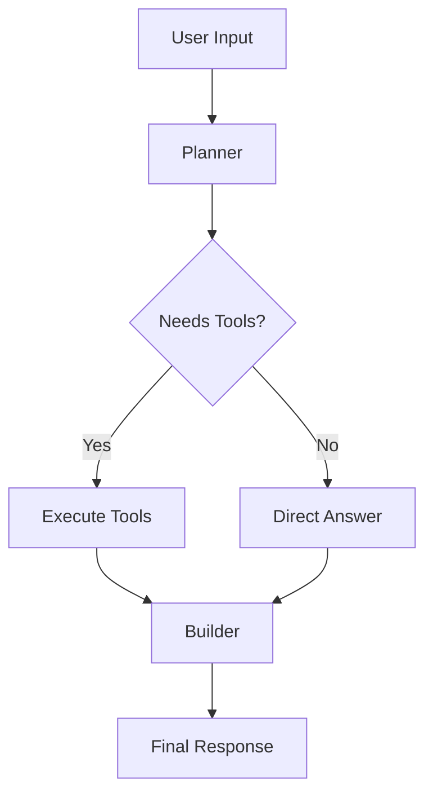

# CLIA: An Efficient Minimalist CLI AI Agent

CLIA, an implentation of COTA (Calibration of Thoughts and Actions), is a minimalist CLI AI agent that uses a plan-build architecture to interact with users and perform various coding tasks. It leverages OpenAI-compatible APIs to provide intelligent assistance with a focus on simplicity and efficiency.

## Features

- **Plan-Build Architecture**: Automatically plans execution steps and builds responses using available tools
- **Multiple Task Types**: Specialized commands for different coding scenarios (ask, draft, explain, debug, fix, generate)
- **Flexible API Configuration**: Works with OpenAI-compatible APIs (supports custom base URLs like ModelScope)
- **Tool Integration**: Built-in tools for file reading, HTTP requests, and text operations
- **Conversation History**: Optional history saving in JSONL format
- **Streaming Support**: Real-time streaming output for faster responses
- **Multiline Input**: Support for complex multi-line queries
- **Customizable Parameters**: Override model settings via command-line arguments
- **Multiple Output Formats**: Markdown, JSON, or plain text output

## Installation

### Prerequisites

- Python 3.7 or higher
- pip package manager

### Install from Source

Clone the repository and install CLIA:

```bash
git clone <repository-url>
cd clia
pip install .
```

### Install Dependencies

CLIA requires the following dependencies (automatically installed with pip install):

- `python-dotenv` - For environment variable management
- `httpx` - For HTTP client functionality
- `openai` - For OpenAI API compatibility

## Configuration

### Environment Variables

Create a `.env` file in the project root (or copy `.env.example`):

```bash
# OpenAI API Configuration
OPENAI_API_KEY=your-api-key-here
OPENAI_BASE_URL=https://api.openai.com/v1
OPENAI_MODEL=gpt-4
OPENAI_STREAM=False
OPENAI_TEMPERATURE=0.0
OPENAI_MAX_TOKENS=4096
OPENAI_MAX_RETRIES=5
OPENAI_TIMEOUT_SECONDS=30
OPENAI_TOP_P=0.85
OPENAI_FREQUENCY_PENALTY=0.0
```

### Using Custom API Providers

CLIA works with any OpenAI-compatible API. For example, to use ModelScope:

```bash
OPENAI_API_KEY=your-modelscope-key
OPENAI_BASE_URL=https://api-inference.modelscope.cn/v1
OPENAI_MODEL="Qwen/Qwen3-Coder-30B-A3B-Instruct"
```

## Usage

### Basic Syntax

```bash
clia <command> [question] [options]
```

### Available Commands

#### `ask` - General Q&A Assistant

Routine question answering for general tasks.

```bash
clia ask "How do I reverse a list in Python?"
clia ask "Explain the concept of recursion" --verbose
```

#### `draft` - Spec-Driven Development

Analyze specifications and generate code implementation.

```bash
clia draft "Create a REST API for user management" --file spec.md
clia draft "Build a todo app with CRUD operations" --multiline
```

#### `explain` - Code Explanation

Explain code snippets and concepts with clear breakdowns.

```bash
clia explain "What does this code do?" --file example.py
clia explain "Explain decorators in Python"
```

#### `debug` - Code Debugging

Identify and fix bugs in code.

```bash
clia debug "This function returns None, why?" --file buggy.py
clia debug "Fix the infinite loop in this code"
```

#### `fix` - Code Fixing with Tests

Locate bugs, provide patches, and generate test cases.

```bash
clia fix "The sorting is not working correctly" --file sort.py
clia fix "Add error handling to this function"
```

#### `generate` - Code Generation

Generate ready-to-run code examples and functions.

```bash
clia generate "Create a function to validate email addresses"
clia generate "Write a web scraper for news articles"
```

### Command-Line Options

#### Input Options

- `question` - The question or task description (can be omitted with `--multiline`)
- `--multiline`, `-m` - Enable multiline input (type `EOF` to end input)
- `--file <path>` - Read question from a file or provide code context

#### Model Parameters

- `--model <name>` - Override the default model
- `--temperature <float>` - Set temperature (0.0-2.0, default from config)
- `--top_p <float>` - Set top_p sampling parameter
- `--max_retries <int>` - Override maximum retry attempts

#### Output Control

- `--stream` - Enable streaming output
- `--quiet` - Suppress non-essential output
- `--output-format {markdown,json,text}` - Set output format (default: markdown)

#### Logging & History

- `--verbose`, `-v` - Enable verbose logging
- `--history <path>` - Save conversation history to a JSONL file
- `--no-history` - Disable history saving

#### Advanced Features

- `--with-calibration` - Enable calibration mode for testing and validation
- `--with-interaction` - Enable interactive mode

### Usage Examples

#### Example 1: Simple Question

```bash
clia ask "What is the difference between list and tuple in Python?"
```

#### Example 2: Multiline Input

```bash
clia draft --multiline
Enter your specification (type EOF to finish):
Create a class for managing a bank account with:
- deposit() method
- withdraw() method
- balance property
- transaction history
EOF
```

#### Example 3: File-Based Code Explanation

```bash
clia explain "Explain the main algorithm" --file algorithms.py
```

#### Example 4: Debugging with Custom Model

```bash
clia debug "Fix the segmentation fault" --file crash.c --model gpt-4 --verbose
```

#### Example 5: Generate with Streaming

```bash
clia generate "Create a REST API endpoint for user authentication" --stream
```

#### Example 6: Save History

```bash
clia ask "Explain machine learning concepts" --history conversations.jsonl
```

#### Example 7: Spec-Driven Development

```bash
clia draft --file requirements.txt --with-calibration
```

## Architecture

CLIA uses a **Plan-Build** pattern:

1. **Planner Phase**: The AI analyzes the request and creates a step-by-step plan using available tools
2. **Builder Phase**: Executes the plan, runs tools, and synthesizes the final response

### Available Tools

- `read_file_safe` - Read local files with size limits
- `echo_safe` - Echo text with size validation
- `http_get` - Perform HTTP GET requests with timeout handling

### Workflow Diagram



## Advanced Configuration

### Overriding Settings

You can override any configuration via command-line arguments:

```bash
clia ask "Your question" --temperature 0.7 --top_p 0.9 --max_retries 3
```

### Using Different Output Formats

```bash
# JSON output for programmatic use
clia ask "Generate JSON data" --output-format json

# Plain text for simple processing
clia ask "Simple answer" --output-format text
```

### Calibration Mode

Enable calibration to test and validate code during generation:

```bash
clia generate "Create a sorting algorithm" --with-calibration
```

## Troubleshooting

### API Connection Issues

If you encounter connection errors:
1. Verify your `OPENAI_API_KEY` is correct
2. Check the `OPENAI_BASE_URL` is accessible
3. Ensure your network allows connections to the API endpoint

### Timeout Errors

Increase timeout settings in `.env`:

```bash
OPENAI_TIMEOUT_SECONDS=60
```

### Large File Reading

The `read_file_safe` tool has a default 4000 character limit. Adjust in your code if needed.

## Development

### Project Structure

```
clia/
├── agents/
│   ├── history.py          # Conversation history management
│   ├── llm.py              # LLM API interface
│   ├── plan_build_agent.py # Plan-build orchestration
│   ├── prompts.py          # Task-specific prompts
│   ├── tool_router.py      # Tool routing and execution
│   └── tools.py            # Available tools
├── config.py               # Configuration management
├── main.py                 # CLI entry point
├── utils.py                # Utility functions
└── __init__.py
```

### Running Tests

```bash
python -m pytest tests/
```

## License

[Specify your license here]

## Contributing

Contributions are welcome! Please feel free to submit a Pull Request.

## Support

For issues and questions, please open an issue on the GitHub repository.
